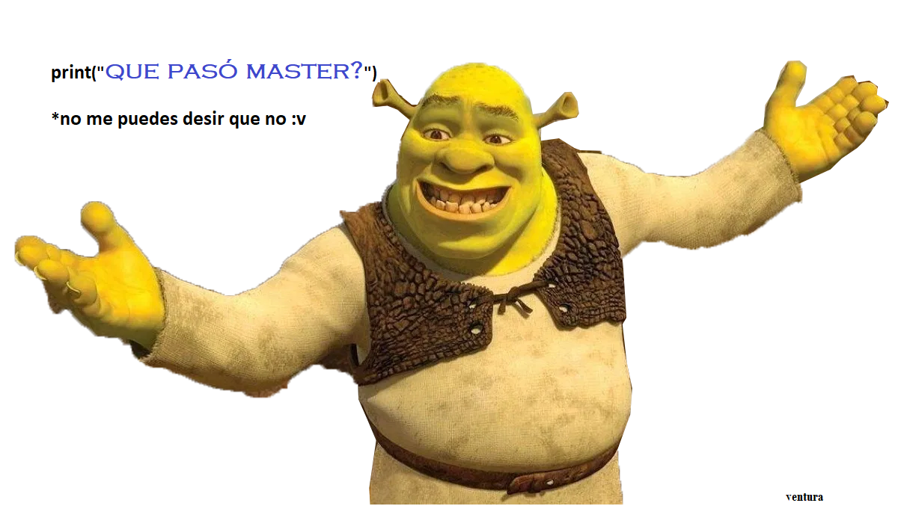

# A.VENTURA_18

<html>
<head>
    <meta charset='utf-8'>
    <meta http-equiv='X-UA-Compatible' content='IE=edge'>
    <title>De Ventura</title>
    <meta name='viewport' content='width=device-width, initial-scale=1'>
    
    
</head>
<body>
    <h1> ¿quires ser mi novia?</h1>
    <input type="button" onclick="accionParaCuandoEllaDigaQueSi()" id="btnSi" value="Si" />
    <input type="button" id="btnNo" onmouseover="mueveElBoton()" value="No" />
    
    
</body>
</html>
